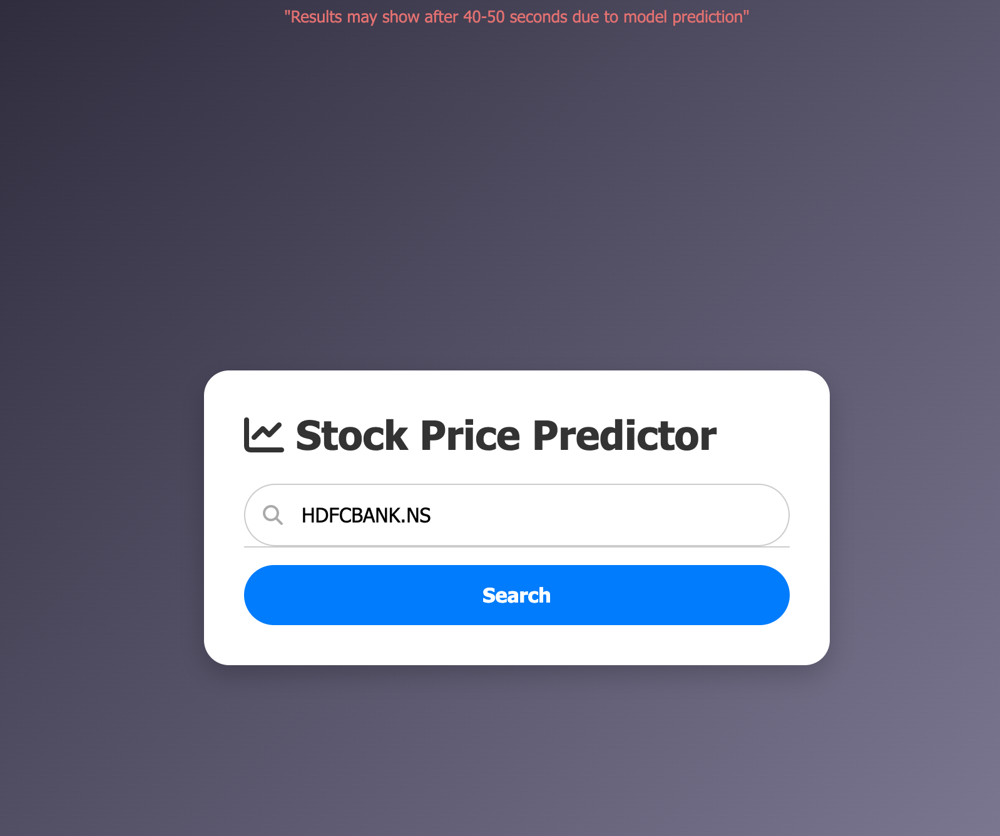
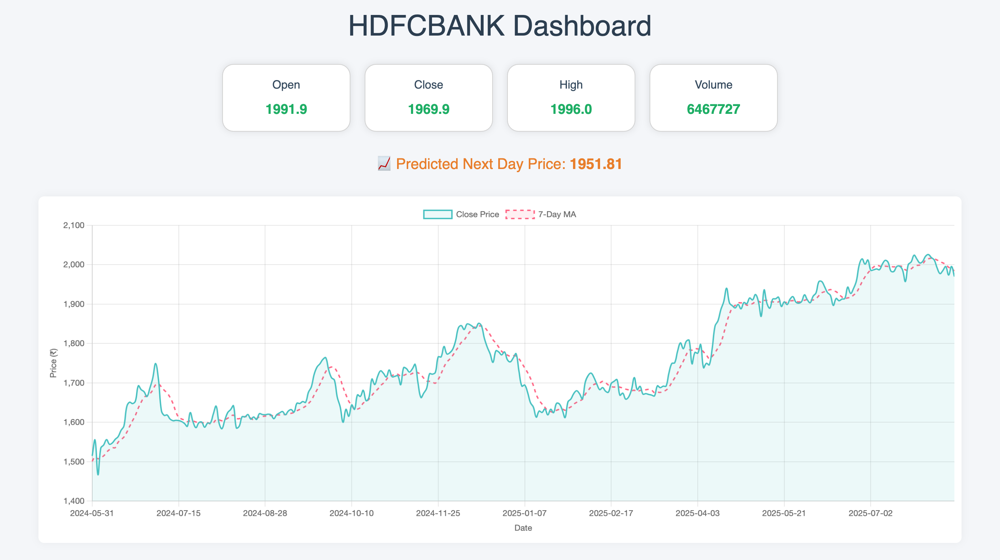

# 📈 Stock Price Prediction using LSTM

***!! Stock Price Prediction !!***

This project uses **Long Short-Term Memory (LSTM)** — a type of Recurrent Neural Network (RNN) — to predict stock closing prices based on historical market data.  
It is designed for **time-series forecasting**, making it ideal for financial data analysis.

---

## 🚀 Features
- Predicts next-day closing prices for selected stocks.
- Uses **historical Yahoo Finance data** for training and prediction.
- Supports multiple stocks with pre-trained `.h5` models.
- Interactive **dashboard** for viewing predictions & historical trends.
- Built with **Flask** for web deployment.
- Charts & visualizations using **Chart.js**.

---

## 📷 Screenshots

---

## 🛠 Tech Stack
- **Backend:** Python, Flask
- **ML Model:** LSTM (Keras/TensorFlow)
- **Data Source:** Yahoo Finance API
- **Frontend:** HTML, CSS, Bootstrap, Chart.js

---
